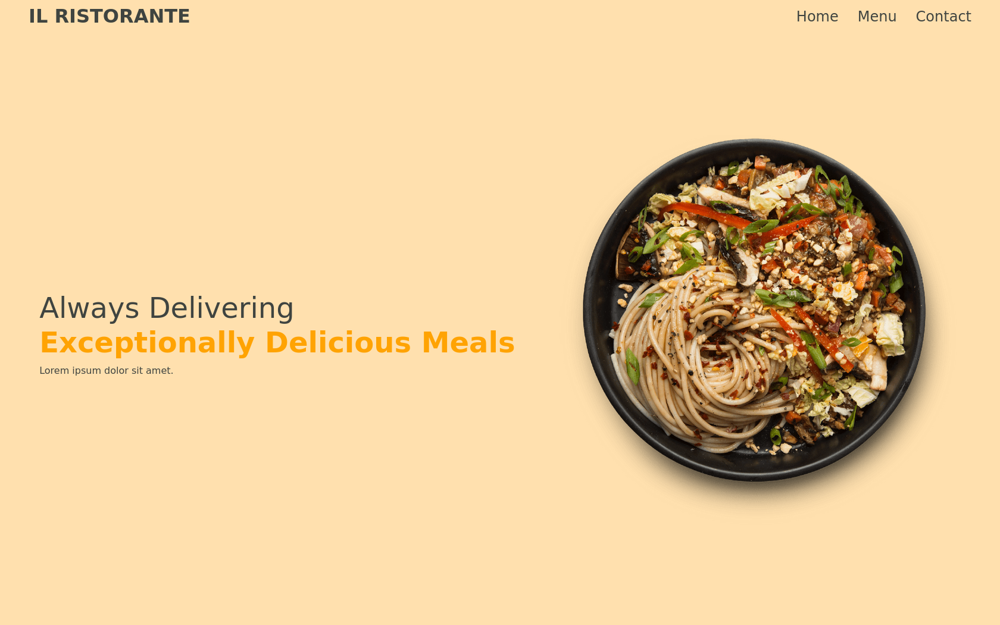

# restaurant-page
A restaurant page made following TOP module and webpack courses
- Live demo [_here_](https://www.example.com).

## General Information
This is a really simply styled webpage made to put in practice all
the topics learnt in the Webpack and ECS6 Modules lesson in TOP.
Although a restaurant webpage was chosen for the lesson. The main
focus is put in the tabular structure of the page and the fact that all the HTML code needed to be dynamically generated by js modules.

Concepts put in practice in this project:
- Use of JS module bundler (Webpack) and its plugins.
- Asset management with Webpack.
- Use of ECS6 modules and separation of concerns.
- Use of exports and imports.
- Proper creation of a project structure and skeleton.

## Technologies Used
- 
- 
- 

## Screenshots

## Project Status
Project is: _complete_

## Comments
I would have never thought that Webpack was such a powerful tool.
Learning how to properly use ECS6 modules together with a module bundler is literally a game changer and I can certainly say that I will be using Webpack as a tool in all my future projects from now.
That made up for the fact that I do not really enjoy styling restaurant pages.

## Acknowledgements
- This project was based on [this lesson](https://www.theodinproject.com/lessons/node-path-javascript-restaurant-page) from TOP
about objects.

## Contact
Created by [Santyru](https://github.com/Santyru-C) - feel free to contact me!
